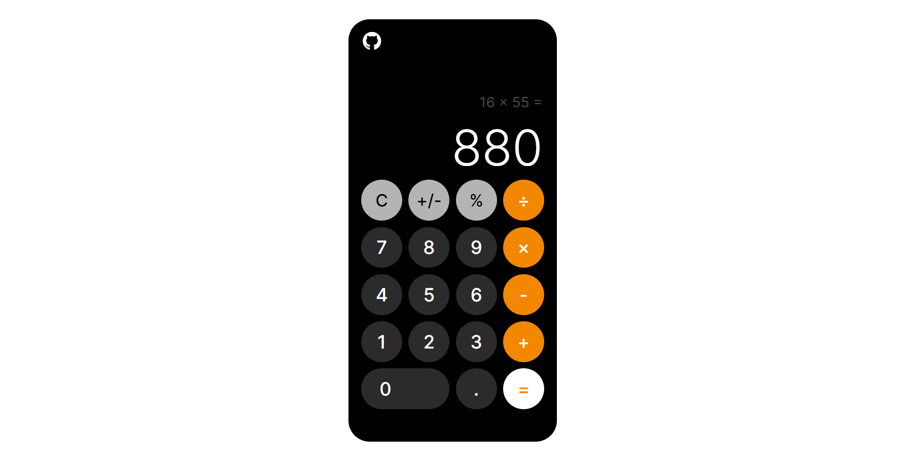

# Calculator
The Odin Project - Foundations Course Project 5:

Developing a browser version of calculator (based off iOS calculator) using Javascript for DOM manipulation + logic and HTML/CSS for UI.

## Preview

## Links
Live Link: https://luciavu.github.io/calculator/

Assignment: https://www.theodinproject.com/lessons/foundations-calculator